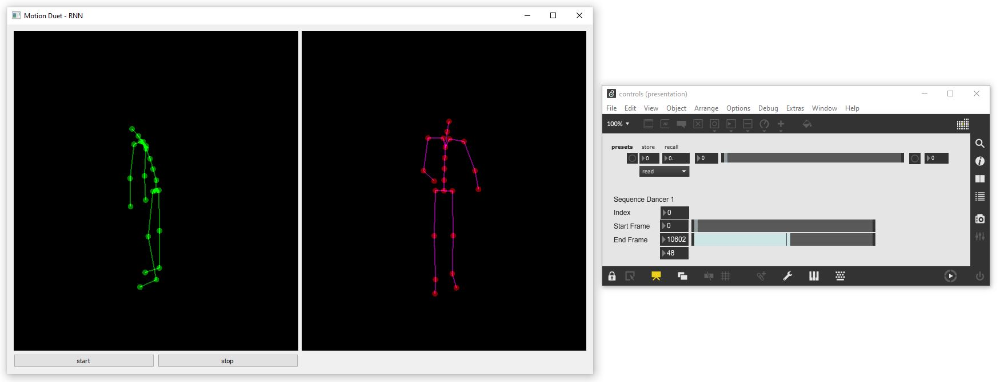

## AI-Toolbox - Motion Duet - RNN Interactive



Figure 1. Screenshot of the RNN Interactive tool. The window on the left shows the original input motion and predicted output motion of the model as simple 3D stick figures in green and red, respectively.  The window on the right is a Max/MSP patch that demonstrates how to send OSC messages to control the RNN Interactive tool. 

### Summary

This Python-based tool can be used to interactively control a motion translation model that has been trained to generate synthetic motion data for an artificial dancer that could act as a partner with a human dancer. This tool is not able to train a machine learning model. For training, the [RNN tool](../rnn) can be used. The tool can be interactively controlled by sending it OSC messages. The tool also emits OSC messages that contain the synthetically generated motion data.  

### Installation

The software runs within the *premiere* anaconda environment. For this reason, this environment has to be setup beforehand.  Instructions how to setup the *premiere* environment are available as part of the [installation documentation ](https://github.com/bisnad/AIToolbox/tree/main/Installers) in the [AI Toolbox github repository](https://github.com/bisnad/AIToolbox). 

The software can be downloaded by cloning the [MotionDuet repository](..). After cloning, the software is located in the MotionDuet / rnn_interactive directory.

### Directory Structure

- rnn_interactive
  - common (contains python scripts for handling mocap data)
  - controls (contains an example Max/MSP patch for interactively controlling the tool)
  - data 
    - media (contains media used in this Readme)
    - mocap (contains an example mocap recording)
    - results
      - weights (contains example trained model weights)

### Usage

#### Start

The tool can be started either by double clicking the `rnn_interactive.bat` (Windows) or `rnn_interactive.sh` (MacOS) shell scripts or by typing the following commands into the Anaconda terminal:

```
conda activate premiere
cd MotionDuet/rnn_interactive
python rnn_interactive.py
```

##### Motion Data and Weights Import

During startup, the tool loads one or several motion capture files and the model weights from a previous training run. The motion capture files are those of the first dancer in a Duet.  By default, the tool loads these files from an example training run whose results are stored in the local data/results folder.  This training run is based on a XSens recording of a Duet improvisation. The model was trained on this data to predict the motion of the second dancer based on the motion of the first dancer. To load a different training run, the following source code has to be modified in the file `rnn_interactive.py.` 

```
mocap_file_path = "data/mocap"
mocap_files = [ "Jason_Take4.fbx" ]
mocap_pos_scale = 1.0
mocap_fps = 50

rnn_weights_file = "data/results/weights/rnn_weights_epoch_200"
```

The string value assigned to the variable `mocap_file_path` specifies the path to the folder that contains motion data files. The list of string values assigned to the variable `mocap_files` specifies the names of the motion data files that will be loaded. The float value assigned to the variable `mocap_pos_scale` specifies a scaling value that is applied to joint positions. The purpose of the scaling value is to bring the position values to cm units. The integer value assigned to the variable `mocap_fps` specifies the number of frames per second with which the motion data is stored. The string value assigned to the variable `rnn_weights_file` specifies the path to the stored weights of a previous training run.

##### Model Settings

The model consists of one or several [Long Short Term Memory](https://www.researchgate.net/publication/13853244_Long_Short-Term_Memory) (LSTM) layers. By default, there are 2 layers and 512 units per layer. Also, by default, the model takes as input a motion sequence that is 64 frames long.  These settings need to be identical to the ones used when training the motion translation model. To use different model settings and/or a different length for the input motion sequence, the the following source code in the file `rnn_interactive.py` has to be modified:

```
sequence_length = 64
rnn_layer_dim = 512
rnn_layer_count = 2
```

The integer value assigned to the variable `sequence_length` specifies the length of the motion sequence that serves as input to the model. The integer value assigned to the variable `rnn_layer_dim` specifies the number of units per LSTM layer. The integer value assigned to the variable `rnn_layer_count` specifies the number of LSTM layers. 

#### Functionality

While the tool is running, it continuously extracts a short short motion sequence from one of the motion capture files of the first dancer that are loaded during startup. The short motion sequence in then passed as input into the motion translation model. Using this input, the model creates synthetic motions for the second dancer in real-time.  As time progresses, the tool increments the frame index from which the input motion sequence is extracted. This frame index changes within the limits of a user specified frame range. When the frame index exceeds the upper end of the corresponding frame range, the frame index wraps around to the lower end of the frame range.  This procedure continues until the tool is stopped. While running, the behaviour of the tool can be controlled by sending it OSC messages. The tool also outputs the predicted frames as OSC messages. 

### Graphical User Interface

The tool provides a minimal GUI  for starting and stopping the motion translation and for displaying both the original motions of the first dancer and the generated motions of the second dancer as simple 3D stick figure (see Figure 1 left side).

### OSC Communication

The tool receives OSC messages that modify its behaviour. These OSC messages either change the frame index, frame range, or offset that is being used when extraction motion sequences of the first dancer as input for the model. 

The following OSC messages are received by the tool:

- Specifies by index the motion capture file of the first dancer from which a new input motion sequence is extract to initialise the model : `/mocap/seqindex <integer index>`
- Specifies by start and end frame index of a frame region within the motion capture file from which motion excerpts are extracted  : `/mocap/seqframerange <integer frame_index_start> <integer frame_index_end> `
- Specifies the offset in number of frames by which the frame position at which motion excerpts from the motion capture file are extracted are incremented in successive extraction steps: `/mocap/seqframeincr <integer frame_offset>`

By default, the tool receives OSC messages from any IP address and on port 9002. To change the IP address and/or port, the following code in the file `rnn_interactive.py` has to be changed:

```
osc_receive_ip = "0.0.0.0"
osc_receive_port = 9002
```

The string value assigned to the variable  `osc_receive_ip` specifies the IP address of the computer from which the tool receives OSC messages. "0.0.0.0" represents any IP address. The integer value assigned to the variable `osc_receive_port` specifies the port on which the tool receives OSC messages.

The software sends the following OSC messages representing the joint positions and rotations of the currently predicted motion frame.
Each message contains all the joint positions and rotations grouped together. In the OSC messages described below, N represents the number of joints.

The following OSC messages are sent by the software:

- joint positions as list of 3D vectors in world coordinates: `/mocap/0/joint/pos_world <float j1x> <float j1y> <float j1z> .... <float jNx> <float jNy> <float jNz>` 
- joint rotations as list of Quaternions in world coordinates: `/mocap/0/joint/rot_world <float j1w> <float j1x> <float j1y> <float j1z> .... <float jNw> <float jNx> <float jNy> <float jNz>` 

By default, the tool sends OSC messages to IP address "127.0.0.1" and to port 9004. To change the IP address and/or port, the following code in the file `rnn_interactive.py` has to be changed:

```
osc_send_ip = "127.0.0.1"
osc_send_port = 9004
```

The string value assigned to the variable  `osc_send_ip` specifies the IP address of the computer to which the tool sends OSC messages. "127.0.0.1" represents the same computer on which the tool is running. The integer value assigned to the variable `osc_send_port` specifies the port to which the tool sends OSC messages.

### Limitations and Bugs

- The tool only generates synthetic motions for a single person.
- The tool reads only motion capture recordings in FBX format in which each skeleton pose has its own keyframe and in which the number of keyframes is the same for all skeleton joints.


