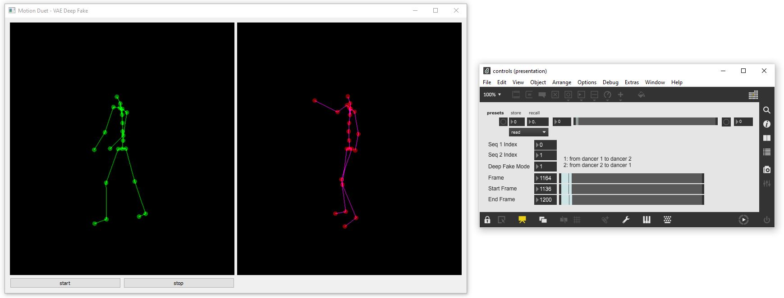

## AI-Toolbox - Motion Continuation - VAE RNN Interactive



Figure 1. Screenshot of the VAE RNN Interactive tool.  The window on the left shows the original input motion and predicted output motion of the model as simple 3D stick figures in green and red, respectively. The window on the right is a Max/MSP patch that demonstrates how to send OSC messages to control the VAE RNN Interactive tool. 

### Summary

This Python-based tool can be used to interactively control a machine learning model that has been trained to generate synthetic motion data for an artificial dancer that could act as a partner with a human dancer. The tool employs a deep fake approach to transform the motions of one dancer so that these motions become more similar to the motions of the other dancer in the duet. This tool is not able to train a machine learning model. For training, the [VAE-RNN tool](../vae-rnn) can be used. The tool can be interactively controlled by sending it OSC messages. The tool also emits OSC messages that contain the synthetically generated motion data.  

### Installation

The software runs within the *premiere* anaconda environment. For this reason, this environment has to be setup beforehand.  Instructions how to setup the *premiere* environment are available as part of the [installation documentation ](https://github.com/bisnad/AIToolbox/tree/main/Installers) in the [AI Toolbox github repository](https://github.com/bisnad/AIToolbox). 

The software can be downloaded by cloning the [MotionDuet repository](..). After cloning, the software is located in the MotionDuet / vae-rnn_interactive directory.

### Directory Structure

- vae-rnn_interactive
  - common (contains python scripts for handling mocap data)
  - controls (contains an example Max/MSP patch for interactively controlling the tool)
  - data 
    - media (contains media used in this Readme)
    - mocap (contains an example mocap recording)
    - results
      - weights (contains example trained model weights)

### Usage

#### Start

The tool can be started either by double clicking the `vae_rnn_interactive.bat` (Windows) or `vae_rnn_interactive.sh` (MacOS) shell scripts or by typing the following commands into the Anaconda terminal:

```
conda activate premiere
cd MocapDuet/vae-rnn_interactive
python vae_rnn_interactive.py
```

##### Motion Data and Weights Import

During startup, the tool imports motion data from one or several pairs of motion files that are stored either in FBX or BVH format. In each pair of motion files, the first file stores the motion data of dancer 1 in the duet, and the second file stores the motion data of the dancer 2 in the duet. During startup, the tool also loads  the model weights from a previous training run. By default, the tool loads these files from an example training run whose results are stored in the local data/results folder.  This training run is based on an XSens recording of a duet improvisation. To load a different training run, the following source code has to be modified in the file `vae_rnn_interactive.py.` 

```
mocap_file_path = "data/mocap"
mocap_files = [ [ "Jason_Take4.fbx", "Sherise_Take4.fbx" ] ]
mocap_pos_scale = 1.0
mocap_fps = 50

encoder_weights_file = "data/results/weights/encoder_weights_epoch_600"
decoder1_weights_file = "data/results/weights/decoder1_weights_epoch_600"
decoder2_weights_file = "data/results/weights/decoder2_weights_epoch_600"
```

The string value assigned to the variable `mocap_file_path` specifies the path to the folder that contains motion data files. The nested list of string values assigned to the variable `mocap_files` specifies the names of motion data files that will be loaded in pairs (one file for the first dancer and the other file for the second dancer in a duet). The nested list of integer values that is assigned to the variable `mocap_valid_frame_ranges` specifies for each motion data file the frame ranges that should be used for training. Each frame range is defined by a start and end frame. It is possible to specify multiple frame ranges per motion data file. Any frames outside of these frame ranges will be excluded from training. The float value assigned to the variable `mocap_pos_scale` specifies a scaling value that is applied to joint positions. The purpose of the scaling value is to bring the position values to cm units. The integer value assigned to the variable `mocap_fps` specifies the number of frames per second with which the motion data is stored. The string values assigned to the variables `encoder_weights_file`,`decoder1_weights_file`, and `decoder2_weights_file` specify the path to the stored weights for the encoder, decoder1, and decoder2 of a previous training run, respectively.

##### Model Settings

This tool follows a deep fake approach. Accordingly, instead of a direct translation of motions from dancer 1 to dancer 2 based on their simulatenous occurence, the tool transform the motions of one dancer so that these motions become more similar to the motions of the other dancer in the duet. In addition, contrary to the direct translation approach, this version of the tool allows to transform motions in both directions, from dancer 1 to dancer 2 and from dancer 2 to dancer 1.  The tool employs an extended version of the Variational Autoencoder that consists of one encoder and two decoders.  The encoder takes as input a short motion excerpt that can either be from dancer 1 or dancer 2. It then outputs the mean and standard deviation of a normal distribution. A latent vector can be obtained by sampling from this distribution. The two decoders are specific for each dancer. Decoder 1 takes as input a latent vector and decompresses it into a short motion excerpt for dancer 1. Decoder 2 takes as input a latent vector and decompresses it into a short motion excerpt for dancer 2. Both the encoder and decoders consist of one or several [Long Short Term Memory](https://www.researchgate.net/publication/13853244_Long_Short-Term_Memory) (LSTM) layers and fully connected layers (Dense) layers.  The number of units for the first and last Dense layer is automatically calculated. The number of units for the middle Dense layer(s) is by default 512. The dimension of the latent vector is by default 32 and the length of motion sequence the model operates on is by default 64.  All these settings need to be identical to the ones used when training the motion transformation model. To use different model settings and/or a different length for the motion sequence, the following source code in the file `vae_rnn_interactive.py` has to be modified:

```
seq_length = 64
latent_dim = 32
ae_rnn_layer_count = 2
ae_rnn_layer_size = 256
ae_rnn_bidirectional = True
ae_dense_layer_sizes = [ 512 ]
```

The integer value assigned to the variable `seq_length` specifies the length (in number of frames) of the motion excerpt the Autoencoder operates on. The integer value assigned to the variable `latent_dim` specifies the dimension of the latent vector representation. The integer value assigned to the variable `ae_rnn_layer_count` specifies the number of LSTM layers in the encoder and decoder models. The integer value assigned to the variable `ae_rnn_layer_size` specifies the number of units per LSTM layer in the encoder and decoder models. The boolean value assigned to the variable ae_rnn_bidirectional specifies if the LSTM layers process sequential data in both forward and backward directions. A value of True corresponds to both forward and backwards direction and a value of False corresponds to forward direction only. The list of integer values assigned to the variable `ae_dense_layer_sizes` specifies the number of units in the Dense layers in the encoder and decoder with the exception of the first and last Dense layer (for which the number of units is determined automatically). 

#### Functionality

While the tool is running, it continuously extracts a short short motion sequence from one of the motion capture files that are loaded during startup. The short motion sequence can either stem from the first dancer or the second dancer in the duet.  As time progresses, the tool increments the frame index from which the input motion sequence is extracted. This frame index changes within the limits of a user specified frame range. When the frame index exceeds the upper end of the corresponding frame range, the frame index wraps around to the lower end of the frame range.  For every time step, the extract motion sequence is passed as input into the encoder of the model. The encoder then outputs the mean and standard deviation of a normal distributions from which a latent vector is sampled. This latent vector is then passed as input either into the decoder1 or decoder2 of the model, depending on whether the purpose of the deep fake effect is to transform the motions of the first dancer into motions that resemble those of the second dancer or vice versa. In the first case, the latent vector is passed into decoder 2, in the second case, the latent vector is passed into decoder 1. The chosen decoder then generates a new motion excerpt. This newly generated motion excerpt is blended together with the previously generated motion excerpt by interpolating the joint rotations using quaternion slerp. This procedure continues until the tool is stopped. While running, the behaviour of the tool can be controlled by sending it OSC messages. The tool also outputs the generated motions as OSC messages. The tool also displays both the original motions of one dancer and the generated motions of the other dancer in the duet as simple 3D stick figures. 

### Graphical User Interface

The tool provides a minimal GUI  for starting and stopping the deep fake model and for displaying the original input motion and predicted output motion as simple 3D stick figures (see Figure 1 left side).

### OSC Communication

The tool receives OSC messages that modify its behaviour. The OSC messages change the motion files and frame regions from which motion excerpts are extracted. and the direction in which the deep fake transformation is applied (either from the first dancer to the second dancer, or from the second dancer to the first dancer).

The following OSC messages are received by the tool:

- Specifies the direction of the deep fake transformation. An integer value of 1 corresponds to the direction from the first dancer to the second dancer. A integer value 2 corresponds to the direction from the second dancer to the first dancer  : `/mocap/deepfakemode <integer mode>`
- Specifies by index a motion capture file of the first dancer from which motion excerpts are extracted  : `/mocap/seq1index <integer file_index>`
- Specifies by index a motion capture file of the second dancer from which motion excerpts are extracted  : `/mocap/seq2index <integer file_index>`
- Specifies by start and end frame index of a frame region within the motion capture file from which motion excerpts are extracted  : `/mocap/seqframerange <integer frame_index_start> <integer frame_index_end> `

By default, the tool receives OSC messages from any IP address and on port 9002. To change the IP address and/or port, the following code in the file `vae_rnn_interactive.py` has to be changed:

```
osc_receive_ip = "0.0.0.0"
osc_receive_port = 9002
```

The string value assigned to the variable  `osc_receive_ip` specifies the IP address of the computer from which the tool receives OSC messages. "0.0.0.0" represents any IP address. The integer value assigned to the variable `osc_receive_port` specifies the port on which the tool receives OSC messages.


The software sends the following OSC messages representing the joint positions and rotations of a pose within the newly generated motion excerpt.
Each message contains all the joint positions and rotations grouped together. In the OSC messages described below, N represents the number of joints.

The following OSC messages are sent by the software:

- joint positions as list of 3D vectors in world coordinates: `/mocap/0/joint/pos_world <float j1x> <float j1y> <float j1z> .... <float jNx> <float jNy> <float jNz>` 
- joint rotations as list of Quaternions in world coordinates: `/mocap/0/joint/rot_world <float j1w> <float j1x> <float j1y> <float j1z> .... <float jNw> <float jNx> <float jNy> <float jNz>` 

By default, the tool sends OSC messages to IP address "127.0.0.1" and to port 9004. To change the IP address and/or port, the following code in the file `vae_rnn_interactive.py` has to be changed:

```
osc_send_ip = "127.0.0.1"
osc_send_port = 9004
```

The string value assigned to the variable  `osc_send_ip` specifies the IP address of the computer to which the tool sends OSC messages. "127.0.0.1" represents the same computer on which the tool is running. The integer value assigned to the variable `osc_send_port` specifies the port to which the tool sends OSC messages.

### Limitations and Bugs

- The tool only generates synthetic motions for a single person.
- The tool reads only motion capture recordings in FBX format in which each skeleton pose has its own keyframe and in which the number of keyframes is the same for all skeleton joints.
